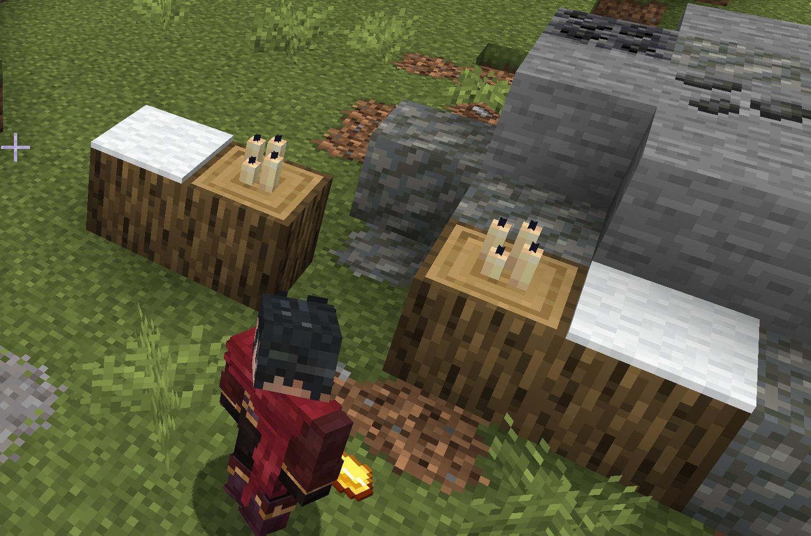
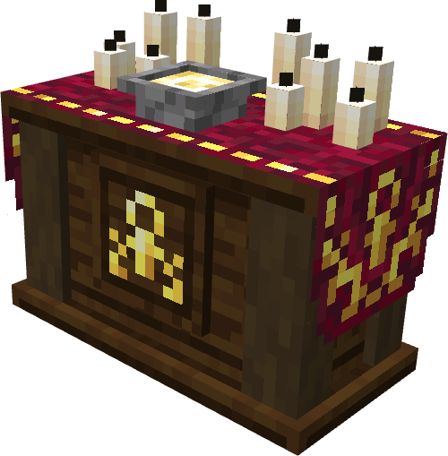

Faith users draw on the powers of the gods in order to work their miracles, even if they do not know their names. Holy magic often is related to smiting undead and other dark forces, as well as healing and bolstering allies. People who choose to focus on both FAI and BOD are often referred to as paladins or crusaders, and take a more active approach in battling enemies of the light, using a mix of smiting and large weapons, but lack as much magical powers as a pure priest.

---

## Holy Altar

The main tool of any faith user is the Prayer Altar. It is created in-world as follows:

*(any combination of candle colours, carpet colours, and log types may be used, and in any rotation)*

Afterward, right-click on it with a gold ingot to form it

---

## Blessings and Devotion

Once an altar has been formed, once a day anyone with at least 1 point in faith can deposit devotion to it, as such it is encouraged for multiple faith users to share an altar, in order to get more and better access to blessings and miracles!

You may only pray at one altar once a day, and an icon will appear in your inventory gui to show when you are able to pray. In addition, an altar with space for devotion will also show an icon over it. R-click on it to pray.

### Holy Objects

Once an altar has enough Devotion, someone with adequate faith can use it to bless objects, infusing them with holy power. This is done by placing the specific item in the vessel on the altar.

- **Holy Grease** = Resin
- **Basic Prayer Book** = Book