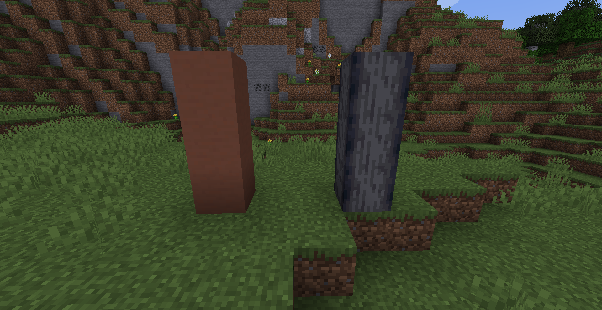
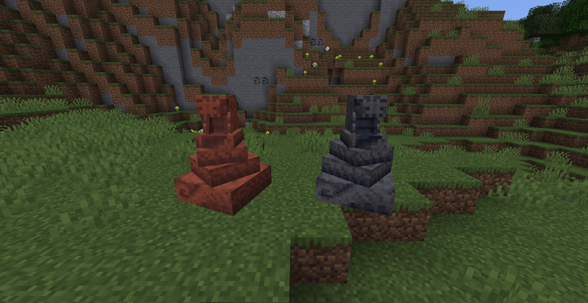

---

## World Pacts

World Pacts are deals made with the world itself, or at least one of its avatars. They offer some strong benefits, often centered around specific classes, but you may take any. You may only have a single World Pact, but you do not have to choose one.

However, some have drawbacks that come with it, and shifting from this world to another will have consequences...

In addition, someone breaking your stela will damage your pact and your very soul, until it is later repaired.

---
## Creating a Pact
Pacts are created after you assemble the stela, which is a 3-tall pillar of either Terracotta or Smooth Basalt, then r-clicking on the bottom block with a piece of flint.

After it is assembled, you may offer it a specific resource to get your pact, and finally, seal the deal by r-clicking on it once more with a Flint and Steel.

*Tip: if you do not use it with a Flint and Steel, the stela can be used for decoration!*

### World Pact Types

Currently, there are three World Pacts. A pact is selected based on the resource given, and then the deal is sealed by r-clicking on it with a Flint and Steel.

- **Preternatural**: Sealed by offering the stela a **Diamond**. Increases the rate at which XP is gained; however death will always claim a level. After lv 9, the XP gain returns to normal but instead casting prowess is increased
- **Persevering**: Sealed by offering the stela an **Emerald**.You will only lose a level every 4 deaths; however XP gain is halved. After lv 9, the effects wanes.
- **Titanic**: Sealed by offering the stela an **Amethyst Block**. Your health increases unnaturally fast, but at the cost of slightly decreased XP gain. At lv 10, the effect wanes.